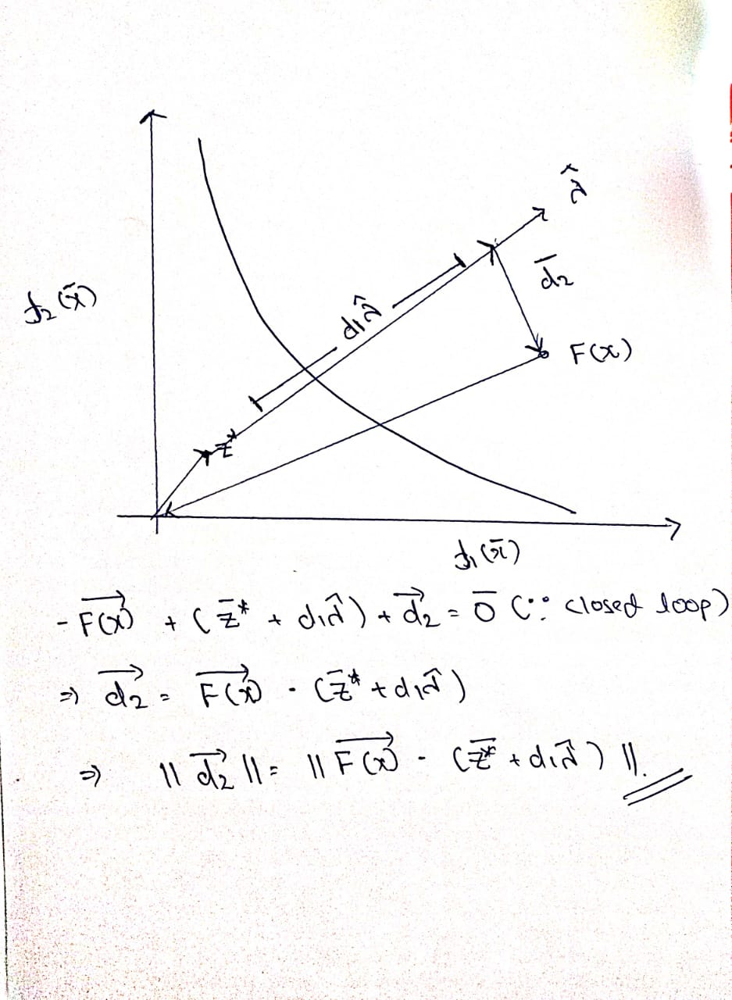
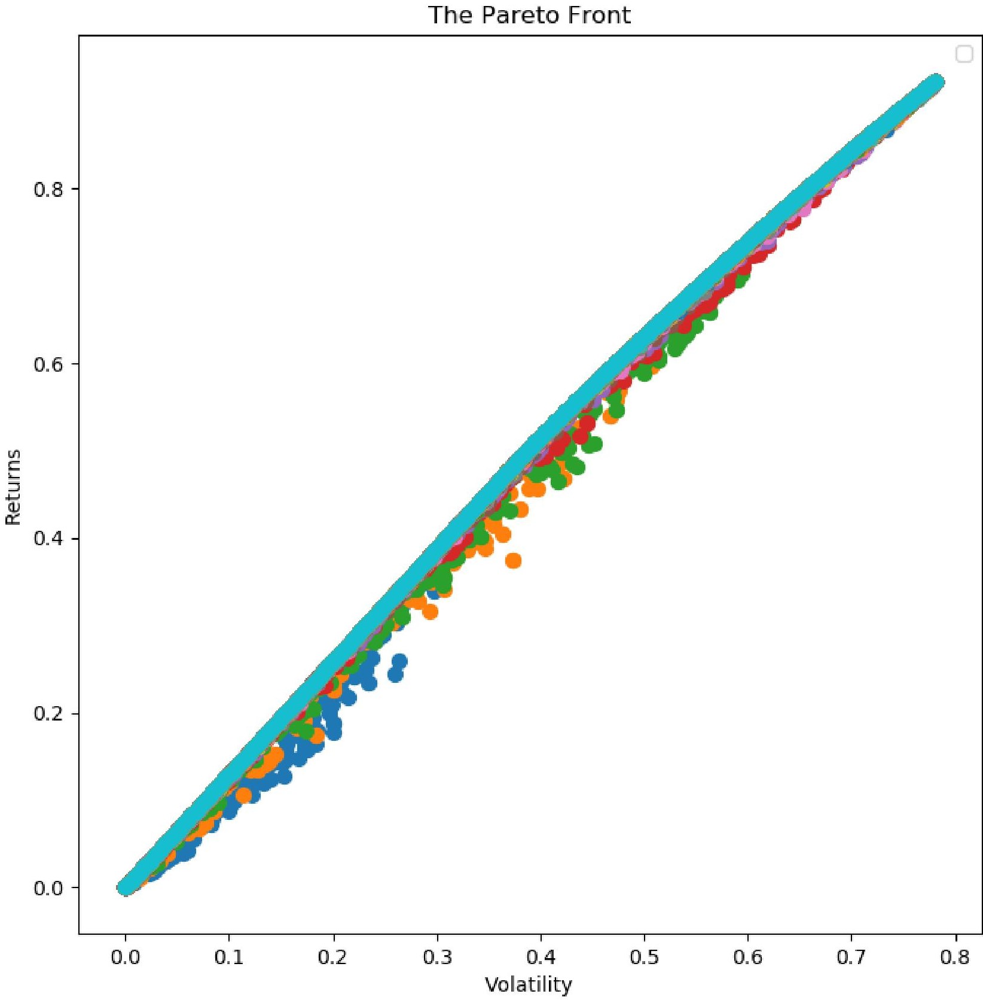
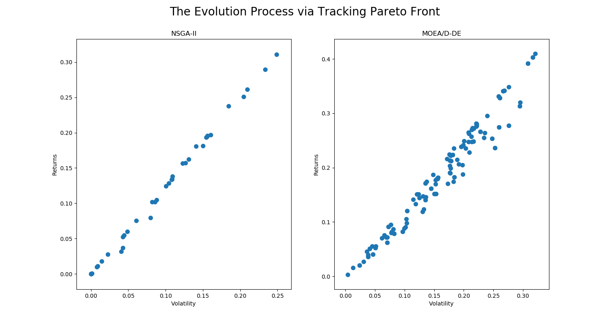
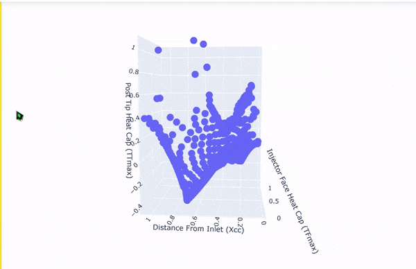

<p align="center">
<a href="https://summerofcode.withgoogle.com/"></a>
<a href="https://www.mlpack.org/"></a>
</p>

My proposal for **A Framework for Multiobjective optimizers** was selected under **Google Summer of Code 2021**. I'll work with the [mlpack](https://mlpack.org/) organization under the mentorship of **Marcus Edel** ([@zoq](https://github.com/zoq)), **Sayan Goswami** ([@say4n](https://github.com/say4n)), **James Balamuta** ([@coatless](https://github.com/coatless)).

Honoring the rites of mlpack, I will post my progress, results, visualizations over the course of my contribution.


<a href="https://github.com/mlpack/ensmallen/pull/293"></a>

<a href="https://github.com/mlpack/examples/pull/160"></a>

<a href="https://github.com/mlpack/examples/pull/160"></a>

<a href="https://github.com/mlpack/ensmallen/issues/294"></a>

<a href="https://github.com/mlpack/examples/pull/165"></a>


## Motivation

The [ensmallen](https://github.com/mlpack/ensmallen) library comes under the umbrella of ```mlpack``` repository. It's a header-only library written in C++ for numerical optimization.```mlpack``` relies heavily on this library for optimizers, callbacks and utilities.
f
The ```ensmallen``` library boasts an extensive set of optimizers that has focused exclusively on single-objective problem sets in the past. Attempts were made in the past, by [Sayan Goswami](https://github.com/mlpack/ensmallen/pull/149) and [Rahul Prabhu](https://github.com/mlpack/ensmallen/pull/120)  on introducing MultiObjective Optimizer(MOO) to this library. These were met with varying degrees of success. It became clear that the library needed to adapt to tackle this unique challenge.

Building upon this foundation, the proposal aims to add cutting edge MOO optimizers, expand the test framework, add type traits, rework callbacks, write documentations to make the library flexible for MultiObjective use cases. The end product would integrate these features seamlessly into the codebase, to work in coherence with the existing interface.

## Pull Requests

### I. Pre-GSoC

* [Improvise Non Dominated Sorting Algorithm - II (NSGA-II)](https://github.com/mlpack/ensmallen/pull/263).
* [Added Indicators to assess MOO Optimizer performance](https://github.com/mlpack/ensmallen/pull/285).
* [Expand CheckArbitraryFunctionTypeAPI to work for MOO](https://github.com/mlpack/ensmallen/pull/283).
* [ZDT Test Suite](https://github.com/mlpack/ensmallen/pull/273).

### II. Community Bonding

 * [Added utility to generate stocks data](https://github.com/mlpack/examples/pull/152).
 * [Add Portfolio Optimization notebook](https://github.com/mlpack/examples/pull/155).
 * [Expand callbacks for MOO Case](https://github.com/mlpack/ensmallen/pull/289).

### Phase -I

### III. Week 1 and 2

 * [Implement MOEA/D-DE](https://github.com/mlpack/ensmallen/pull/269).
 * [Introduce Policy Methods for MOEA/D-DE](https://github.com/mlpack/ensmallen/pull/293).
 * [Add Das-Dennis weight initialization method](https://github.com/mlpack/ensmallen/pull/295).
 * [Add Dirichlet Weight Initialization](https://github.com/mlpack/ensmallen/pull/296).

### III. Week 3 and 4
 * [**Release version 2.17.0: "25 Din Mein Paisa Double"**](https://github.com/mlpack/ensmallen/pull/308). 
 * [Refine Portfolio Notebook.](https://github.com/mlpack/examples/pull/160).
 * [Battle of the Optimizers](https://github.com/mlpack/ensmallen/issues/294).
 * [Added util to print gif](https://github.com/mlpack/examples/pull/164).
 * [Rocket injector design optimization](https://github.com/mlpack/examples/pull/165).

### Phase -II 

### IV. Week 5 and 6
  * [Add Unity simulator and interactive graph for Rocket Injector notebook.](https://github.com/mlpack/examples/pull/171).


 ## A note of thanks

 I would like to thank these people without whom, this project wouldn't have been possible. Shaikh Mohammad Fauz  ([@FieryBlade-313](https://github.com/FieryBlade-313)) for the gif and Sagar Sehgal ([@Sagar](https://github.com/thesagarsehgal)) for the guidance.
